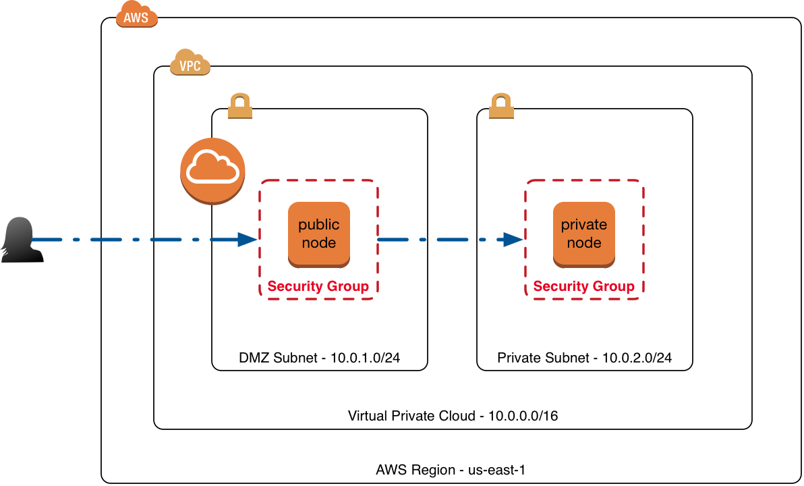

# Terraform'd VPC

This is a standard VPC with a bastion host.  This follows most classroom style VPC teachings, only created so that the student can get familiar with a Terraform way of doing things.



## Reading

* [Terraform](http://terraform.io/docs) 


### Prereqs

* AWS CLI installed and configured with key and secret
* Terrafrom CLI installed

## Conventions
Supports bring your own ssh key.

```bash
project_name     = "MYVPC"           # Some identifier for your project (MYVPC is default)
my_ip            = "X.X.X.X/32"      # Your ip in CIDR for bastion, remember the /32
public_key_path  = "~/.ssh/foo.pub"  # path to your pub key
```

To get your ip in CIDR format:
```bash
# From http://www.cyberciti.biz/faq/how-to-find-my-public-ip-address-from-command-line-on-a-linux/
# Also in .aliases file
dig +short myip.opendns.com @resolver1.opendns.com
```

## Run it!
```bash
$ terraform plan
$ terraform apply

# The bastion IP will be in outputs:

Outputs:

  ip = 54.x.x.x

# ssh to the bastion!
$ ssh -i ~/.ssh/my_keypair ubuntu@x.x.x.x # IP from outputs
```

## Some aliases to save fingers (.aliases file)

Contents:
```bash
alias tp="terraform plan"
alias ta="terraform apply"
alias tpd="terraform plan -destroy"
alias td="terraform destroy"
alias myip="dig +short myip.opendns.com @resolver1.opendns.com"
```

Add to your .zshrc or .bashrc, or simply:
```
$ . ./.aliases
```

## SSH help

If on mac it is probably best to use agent forwarding to hop around

Add your key
```bash
$ ssh-add
```

```bash
$ ssh -A -i ~/.ssh/my_keypair ubuntu@x.x.x.x # IP from outputs
```
